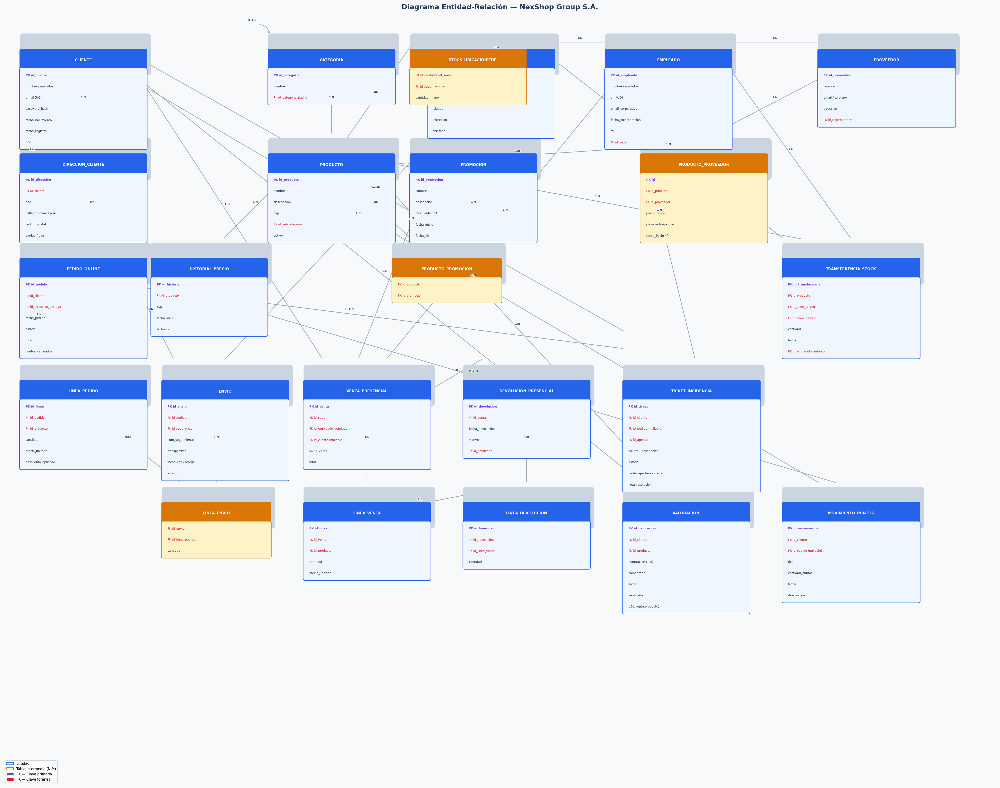

# NexShop Group S.A. — Base de Datos

**Alumno:** Sara  
**Proyecto:** Mini Proyecto Avanzado — Base de Datos  
**Nivel:** Intermedio-Avanzado  

---

## Descripción del proyecto

Diseño e implementación desde cero de la base de datos relacional de **NexShop Group S.A.**, una empresa de distribución y venta al por menor con sede en Valencia. Opera a través de una tienda online (nexshop.es) y tres tiendas físicas en Valencia, Madrid y Barcelona, compartiendo catálogo pero con gestión independiente.

El modelo cubre: catálogo de productos, gestión de clientes, pedidos online, ventas presenciales, logística de envíos y stock, proveedores, atención al cliente, programa de fidelización y valoraciones.

---

## Estructura del repositorio

```
mi-proyecto-nexshop/
│
├── README.md                    ← Este archivo
├── docs/
│   ├── memoria.md               ← Análisis de entidades, atributos, relaciones y preguntas de reflexión
│   ├── diagrama_er.png          ← Diagrama Entidad-Relación completo
│   └── modelo_relacional.md     ← Notación relacional con PKs, FKs y restricciones
├── sql/
│   ├── schema.sql               ← CREATE TABLE con tipos, restricciones y claves foráneas
│   └── datos.sql                ← INSERT con datos de prueba realistas
└── consultas/
    └── consultas.sql            ← 14 consultas MySQL comentadas
```

---

## Diagrama ER



---

## Cómo importar la base de datos

### Requisitos
- MySQL 8.x o MariaDB 10.6+
- Cliente MySQL (terminal, MySQL Workbench, DBeaver, etc.)

### Pasos

**1. Crear el esquema y las tablas:**
```bash
mysql -u root -p < sql/schema.sql
```

**2. Insertar los datos de prueba:**
```bash
mysql -u root -p nexshop < sql/datos.sql
```

**3. Ejecutar las consultas:**
```bash
mysql -u root -p nexshop < consultas/consultas.sql
```

O alternativamente, abre los archivos en MySQL Workbench y ejecútalos en orden.

### Verificación rápida
```sql
USE nexshop;
SHOW TABLES;
SELECT COUNT(*) FROM producto;    -- Debe devolver 15
SELECT COUNT(*) FROM empleado;    -- Debe devolver 15
SELECT COUNT(*) FROM cliente;     -- Debe devolver 10
```

---

## Resumen del modelo

| Componente | Detalle |
|---|---|
| Total de tablas | 24 |
| Relaciones N:M resueltas | 4 (producto_promocion, producto_proveedor, stock_ubicacion, linea_envio) |
| Motor de base de datos | MySQL 8.x (InnoDB) |
| Juego de caracteres | utf8mb4 / utf8mb4_unicode_ci |

---

## Decisiones de diseño destacadas

- **Categorías auto-referenciales**: una sola tabla soporta categorías y subcategorías a cualquier profundidad.
- **Clientes anónimos**: campo `id_cliente` nullable en `venta_presencial` para soportar compras en tienda sin registro, con posibilidad de vinculación posterior.
- **Pedidos online y ventas presenciales separadas**: tablas distintas por diferencia de atributos y flujos de negocio.
- **Saldo de puntos calculado**: no existe campo `saldo_actual`; el saldo se obtiene siempre con `SUM(cantidad_puntos)` sobre `movimiento_puntos`.
- **Historial de precios y promociones independientes**: `historial_precio` registra la evolución del PVP base; `promocion` registra descuentos temporales de marketing.
